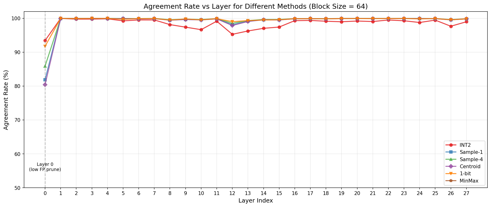

# Block筛选方法对比分析 - 关键结论

## 总结表格

### 量化方法对比 (Block Size = 64)

| 方法 | 量化类型 | 平均一致率 | L14一致率 | 平均误剪率 | L14误剪率 | 推荐度 |
|------|----------|-----------|----------|-----------|----------|--------|
| **2-bit-asym** | 非对称 | 99.53% | 99.22% | 0.06% | 0.04% | ⭐⭐⭐⭐⭐ |
| **1-bit-asym** | 非对称 | 99.48% | 99.50% | 0.36% | 0.13% | ⭐⭐⭐⭐⭐ |
| **2-bit-sym** | 对称 | 98.47% | 97.04% | 0.03% | 0.01% | ⭐⭐⭐⭐ |
| 1-bit-sym | 对称 | 27.48% | 39.30% | 0.02% | 0.01% | ❌ |

**关键发现: 非对称量化 >> 对称量化**

### 对称 vs 非对称量化对比

| 方法 | BS=64 | BS=128 | BS=256 | BS=512 | 衰减幅度 |
|------|-------|--------|--------|--------|----------|
| **2-bit-asym (非对称)** | 99.53% | 99.35% | 99.01% | 98.52% | **-1.00%** |
| **1-bit-asym (非对称)** | 99.48% | 99.40% | 99.24% | 98.97% | **-0.52%** |
| 2-bit-sym (对称) | 98.47% | 97.57% | 95.98% | 93.51% | -4.96% |
| 1-bit-sym (对称) | 27.48% | 22.26% | 17.02% | 12.93% | -14.55% |

**核心结论**:
- **非对称量化是关键**: 使用 mean 作为 zero-point 比以 0 为中心效果好得多
- **1-bit 对称量化完全失效**: 一致率仅 27%，不可用
- **2-bit 对称量化衰减快**: BS=512 时降至 93.51%
- **非对称量化对 bit 数不敏感**: 2-bit-asym 和 1-bit-asym 表现相当

### 各方法综合对比 (Block Size = 64)

| 方法 | 平均一致率 | L14一致率 | 平均误剪率 | L14误剪率 | 计算量 | 推荐度 |
|------|-----------|----------|-----------|----------|--------|--------|
| **2-bit-asym** | 99.53% | 99.22% | 0.06% | 0.04% | 中 | ⭐⭐⭐⭐⭐ |
| **1-bit-asym** | 99.48% | 99.50% | 0.36% | 0.13% | 低 | ⭐⭐⭐⭐⭐ |
| **Sample-4采样** | 99.30% | 99.66% | 0.70% | 0.34% | 低 | ⭐⭐⭐⭐⭐ |
| **Sample-1采样** | 99.09% | 99.58% | 0.91% | 0.42% | 极低 | ⭐⭐⭐⭐ |
| **质心法** | 99.03% | 99.57% | 0.97% | 0.43% | 极低 | ⭐⭐⭐⭐ |
| **2-bit-sym** | 98.47% | 97.04% | 0.03% | 0.01% | 中 | ⭐⭐⭐⭐ |
| MinMax上界 | 1.87% | 0.46% | 0.00% | 0.00% | 低 | ⭐ |

### 各方法综合对比 (Block Size = 128)

| 方法 | 平均一致率 | L14一致率 | 平均误剪率 | L14误剪率 |
|------|-----------|----------|-----------|----------|
| **2-bit-asym** | 99.35% | 99.26% | 0.07% | 0.04% |
| **1-bit-asym** | 99.40% | 99.53% | 0.40% | 0.15% |
| **Sample-4采样** | 99.14% | 99.60% | 0.86% | 0.40% |
| **Sample-1采样** | 98.91% | 99.51% | 1.09% | 0.49% |
| **质心法** | 98.85% | 99.50% | 1.15% | 0.50% |
| **2-bit-sym** | 97.57% | 96.13% | 0.03% | 0.01% |
| MinMax上界 | 1.33% | 0.50% | 0.00% | 0.00% |

### 各方法综合对比 (Block Size = 256)

| 方法 | 平均一致率 | L14一致率 | 平均误剪率 | L14误剪率 |
|------|-----------|----------|-----------|----------|
| **1-bit-asym** | 99.24% | 99.36% | 0.45% | 0.22% |
| **2-bit-asym** | 99.01% | 98.88% | 0.11% | 0.08% |
| **Sample-4采样** | 98.91% | 99.36% | 1.09% | 0.64% |
| **Sample-1采样** | 98.64% | 99.24% | 1.36% | 0.76% |
| **质心法** | 98.57% | 99.22% | 1.43% | 0.78% |
| **2-bit-sym** | 95.98% | 93.62% | 0.03% | 0.00% |
| MinMax上界 | 1.50% | 0.78% | 0.00% | 0.00% |

### 各方法综合对比 (Block Size = 512)

| 方法 | 平均一致率 | L14一致率 | 平均误剪率 | L14误剪率 |
|------|-----------|----------|-----------|----------|
| **1-bit-asym** | 98.97% | 99.01% | 0.59% | 0.35% |
| **2-bit-asym** | 98.52% | 98.14% | 0.20% | 0.15% |
| **Sample-4采样** | 98.56% | 98.96% | 1.44% | 1.04% |
| **Sample-1采样** | 98.19% | 98.72% | 1.81% | 1.28% |
| **质心法** | 98.13% | 98.71% | 1.87% | 1.29% |
| **2-bit-sym** | 93.51% | 89.96% | 0.04% | 0.01% |
| MinMax上界 | 1.89% | 1.29% | 0.00% | 0.00% |

### 各方法随 Block Size 变化趋势 (平均一致率)

| 方法 | BS=64 | BS=128 | BS=256 | BS=512 | 衰减幅度 |
|------|-------|--------|--------|--------|----------|
| **2-bit-asym** | 99.53% | 99.35% | 99.01% | 98.52% | -1.00% |
| **1-bit-asym** | 99.48% | 99.40% | 99.24% | 98.97% | -0.52% |
| **Sample-4采样** | 99.30% | 99.14% | 98.91% | 98.56% | -0.74% |
| **Sample-1采样** | 99.09% | 98.91% | 98.64% | 98.19% | -0.90% |
| **质心法** | 99.03% | 98.85% | 98.57% | 98.13% | -0.90% |
| **2-bit-sym** | 98.47% | 97.57% | 95.98% | 93.51% | -4.96% |

**关键发现**:
- **非对称量化衰减最慢**: 1-bit-asym 仅衰减 0.52%，2-bit-asym 衰减 1.00%
- **对称量化衰减快**: 2-bit-sym 衰减 4.96%
- **大 Block Size 推荐非对称量化**: BS≥256 时非对称量化明显优于对称量化

*注: "平均"为全28层平均，"L14"为Layer 14单层结果*

### 层间一致率对比图



**关键观察**:
- **Layer 0 是异常层**: 所有方法在Layer 0的一致率都显著下降
- **2-bit在Layer 0表现最好**: 93.4% vs Sample-1的81.9%
- **其他层表现稳定**: Layer 1-27的一致率普遍>99%

### 推荐方案

| 场景 | 推荐方法 | 理由 |
|------|----------|------|
| **最高精度** | 2-bit-asym | 一致率99.53%，误剪率仅0.06% |
| **追求精度+低存储** | 1-bit-asym | 一致率99.48%，存储更少 |
| **极致速度** | Sample-1采样 | 一致率99.1%，计算量仅1/block_size |
| **大Block Size** | 1-bit-asym | BS=512时仍有98.97%，衰减最慢 |
| **低误剪要求** | 2-bit-asym | 误剪率仅0.06%，最安全 |
| **极致压缩** | 1bit-Sample1 | 存储1/16，计算1/64，一致率99.08% |
| **平衡方案** | 2bit-Sample4 | 存储1/8，计算1/16，一致率99.28% |

### 量化+采样组合方法

同时使用量化和采样可以双重减少带宽和计算量：

| 方法 | 存储 | 计算量 | 平均一致率 | 平均误剪率 |
|------|------|--------|-----------|-----------|
| **单独方法** |
| FP全量 | 16 bit | 100% | 100% (基准) | 0% |
| FP-Sample1 | 16 bit | 1/BS | 99.09% | 0.91% |
| FP-Sample4 | 16 bit | 4/BS | 99.30% | 0.70% |
| 2bit-asym | 2 bit | 100% | 99.53% | 0.06% |
| 1bit-asym | 1 bit | 100% | 99.48% | 0.36% |
| **组合方法** |
| 2bit-Sample1 | 2 bit | 1/BS | 99.09% | 0.90% |
| 2bit-Sample4 | 2 bit | 4/BS | 99.28% | 0.69% |
| 1bit-Sample1 | 1 bit | 1/BS | 99.08% | 0.92% |
| 1bit-Sample4 | 1 bit | 4/BS | 99.21% | 0.77% |

**关键发现**:
- **组合方法几乎无损**: `2bit-Sample1`(99.09%) ≈ `FP-Sample1`(99.09%)
- **精度由采样决定**: 量化后再采样不会显著增加误差
- **双重节省**: `1bit-Sample1` 存储减少16x，计算量减少64x，一致率仍有99.08%

### 组合方法随 Block Size 变化 (平均一致率)

| 方法 | BS=64 | BS=128 | BS=256 | BS=512 | 衰减 |
|------|-------|--------|--------|--------|------|
| 2bit-Sample1 | 99.09% | 98.92% | 98.66% | 98.20% | 0.89% |
| 2bit-Sample4 | 99.28% | 99.11% | 98.85% | 98.43% | 0.84% |
| 1bit-Sample1 | 99.08% | 98.90% | 98.63% | 98.18% | 0.90% |
| 1bit-Sample4 | 99.21% | 99.03% | 98.76% | 98.33% | 0.89% |

---

## 实验设置

- **模型**: Llama-3.2-3B
- **数据**: LongBench gov_report (256k tokens)
- **序列长度**: 262,144 tokens
- **Q头数**: 24, **KV头数**: 8 (GQA, G=3)
- **头维度**: 128
- **层数**: 28
- **测试Block Size**: 64, 128, 256, 512
- **阈值Delta**: 5.0
- **FP Ground Truth剪枝率**: ~99%

---

## 1. 量化筛选方法

### 1.1 对称 vs 非对称量化

**对称量化 (Symmetric)**: 以 0 为中心
```
k_quantized = round(k / scale) * scale
scale = max(|k|) / (2^(bits-1) - 0.5)
```

**非对称量化 (Asymmetric)**: 以 mean 为中心
```
k_quantized = mean + round((k - mean) / scale) * scale
scale = std * 2  (覆盖约 ±3 std 范围)
```

**为什么非对称量化更好？**
- K 向量的值通常不以 0 为中心，而是有非零均值
- 使用 mean 作为 zero-point 可以更好地利用量化级别
- std 作为 scale 天然适应不同 block 的数据分布

### 1.2 2-bit-asym (2-bit 非对称量化) ⭐⭐⭐⭐⭐

**原理**: `k' = mean + (round((k - mean) / scale + 1.5) - 1.5) * scale`

| Block Size | 平均一致率 | L14一致率 | 平均误剪率 | 衰减 |
|------------|-----------|----------|-----------|------|
| 64 | **99.53%** | 99.22% | 0.06% | - |
| 128 | 99.35% | 99.26% | 0.07% | -0.18% |
| 256 | 99.01% | 98.88% | 0.11% | -0.52% |
| 512 | 98.52% | 98.14% | 0.20% | -1.00% |

**结论**:
- ✅ 一致率最高 (99.53%)
- ✅ 误剪率最低 (0.06%)
- ✅ 衰减较慢 (BS=512 时仍有 98.52%)

### 1.3 1-bit-asym (1-bit 非对称量化) ⭐⭐⭐⭐⭐

**原理**: `k' = mean + sign(k - mean) * std`

| Block Size | 平均一致率 | L14一致率 | 平均误剪率 | 衰减 |
|------------|-----------|----------|-----------|------|
| 64 | **99.48%** | 99.50% | 0.36% | - |
| 128 | 99.40% | 99.53% | 0.40% | -0.08% |
| 256 | 99.24% | 99.36% | 0.45% | -0.24% |
| 512 | 98.97% | 99.01% | 0.59% | -0.52% |

**结论**:
- ✅ 衰减最慢 (BS=512 时仍有 98.97%)
- ✅ 存储效率高 (每元素仅 1 bit + mean/std)
- ⚠️ 误剪率略高于 2-bit-asym (0.36% vs 0.06%)

### 1.4 2-bit-sym (2-bit 对称量化) ⭐⭐⭐⭐

**原理**: `k' = round(k / scale + 1.5) * scale - 1.5 * scale, scale = max(|k|) / 1.5`

| Block Size | 平均一致率 | L14一致率 | 平均误剪率 | 衰减 |
|------------|-----------|----------|-----------|------|
| 64 | 98.47% | 97.04% | 0.03% | - |
| 128 | 97.57% | 96.13% | 0.03% | -0.90% |
| 256 | 95.98% | 93.62% | 0.03% | -2.49% |
| 512 | 93.51% | 89.96% | 0.04% | -4.96% |

**结论**:
- ⚠️ 一致率随 Block Size 衰减较快
- ✅ 误剪率极低 (0.03%)
- ❌ BS≥256 时不推荐

### 1.5 1-bit-sym (1-bit 对称量化) ❌

**原理**: `k' = sign(k) * std`

| Block Size | 平均一致率 | L14一致率 |
|------------|-----------|----------|
| 64 | 27.48% | 39.30% |
| 512 | 12.93% | 17.90% |

**结论**:
- ❌ **完全不可用** - 一致率仅 27%
- ❌ K 向量不以 0 为中心，对称量化丢失大量信息

---

## 2. 采样类方法

### 2.1 Sample-4 (4点采样) ⭐⭐⭐⭐

**原理**: 从block中均匀采样4个位置，取最大分数

| Block Size | 剪枝率 | 一致率 | 误剪率 | 漏剪率 |
|------------|--------|--------|--------|--------|
| 8 | 99.7% | **99.8%** | 0.14% | 0.0% |
| 16 | 99.7% | 99.7% | 0.29% | 0.0% |
| 32 | 99.6% | 99.5% | 0.47% | 0.0% |
| 64 | 99.6% | 99.3% | 0.65% | 0.0% |

**结论**:
- ✅ 计算量仅为完整block的 4/block_size (BS=64时仅6.25%)
- ✅ 一致率接近2-bit
- ⚠️ Block越大误剪率越高 (但仍<1%)
- ✅ 漏剪率为0 (采样点足够覆盖)

### 2.2 Sample-1 (单点采样) ⭐⭐⭐⭐

**原理**: 只取block中间位置的K向量

**Block Size = 64 统计** (使用统一FP阈值):
- 平均一致率: 99.09%
- L14一致率: 99.58%
- 平均误剪率: 0.91%

**结论**:
- ✅ 计算量最小 (1/block_size)
- ✅ 一致率高达99%+
- ⚠️ Layer 0一致率下降至81.9% (见下方说明)

### 2.3 层间差异分析 (重要)

**方法论说明**: 所有一致率统计均使用**统一的FP阈值** (`threshold = max(fp_score[first], fp_score[last]) - delta`)，这样才能公平比较不同方法在相同标准下的表现。

**发现**: 不同层的筛选特性差异巨大

| Layer | 2-bit | Sample-1 | Sample-4 | Centroid | 1-bit | MinMax |
|-------|------|----------|----------|----------|-------|--------|
| 0 | 93.4% | 81.9% | 85.9% | 80.4% | **91.8%** | 20.4% |
| 1 | 100.0% | 99.9% | 100.0% | 99.9% | 100.0% | 3.4% |
| 7 | 99.5% | 99.9% | 100.0% | 99.9% | 99.9% | 0.6% |
| 14 | 97.0% | 99.6% | 99.7% | 99.6% | 99.5% | 0.5% |
| 27 | 99.0% | 99.8% | 99.9% | 99.8% | 99.8% | 0.4% |
| **平均** | **98.5%** | **99.1%** | **99.3%** | **99.0%** | **99.5%** | **1.9%** |

**解释**:
- **Layer 0 是异常层**: FP剪枝率仅79.6%，所有方法一致率大幅下降
- **2-bit和1-bit在Layer 0表现最好**: 93.4%和91.8%，量化方法比采样更稳定
- **其他层表现稳定**: Layer 1-27的一致率普遍>99%

**建议**: 对Layer 0需要特殊处理，可以:
1. 跳过Layer 0的稀疏化
2. 使用更保守的阈值delta
3. 使用2-bit或1-bit而非采样（Layer 0上量化方法更稳定）

### 2.4 采样变体分析

**测试配置**:
- 采样数量: 1, 2, 4
- 采样位置: 均匀分布 / 前N个 / 后N个
- 是否组合2-bit: FP采样 / 采样后2-bit量化

**Block Size = 64 时的对比**:

| 方法 | 一致率 | 误剪率 | 漏剪率 |
|------|--------|--------|--------|
| Sample-4-first (FP) | 99.64% | 0.36% | 0.0% |
| Sample-4-uniform (FP) | 99.63% | 0.37% | 0.0% |
| Sample-4-last (FP) | 99.63% | 0.37% | 0.0% |
| Sample-2-uniform (FP) | 99.61% | 0.39% | 0.0% |
| Sample-1-uniform (FP) | 99.58% | 0.42% | 0.0% |
| Sample-4-uniform-2-bit | 99.57% | 0.34% | 0.1% |

**关键发现**:

1. **采样位置影响极小**: 均匀/前4/后4 一致率差异<0.1%
2. **采样+2-bit组合**: 与纯FP采样相比差异仅0.06%，但误剪率反而更低
3. **采样数量**: 1/2/4点采样差异很小 (0.05%)，即使1点也达99.58%
4. **结论**: 采样策略的选择不重要，更多采样点边际收益递减

---

## 3. 压缩表示方法

### 3.1 质心法 (Centroid) ⭐⭐⭐

**原理**: 用block的K均值代替整个block，`score ≈ q · mean(K_block)`

| Block Size | 剪枝率 | 一致率 | 误剪率 | 漏剪率 |
|------------|--------|--------|--------|--------|
| 8 | 98.6% | 98.7% | 0.14% | 1.1% |
| 16 | 98.2% | 98.4% | 0.20% | 1.4% |
| 32 | 97.3% | 97.6% | 0.22% | 2.1% |
| 64 | 93.9% | 94.5% | 0.18% | 5.3% |

**结论**:
- ✅ 只需存储1个向量/block
- ✅ 计算量极低
- ⚠️ 大block下漏剪率上升

### 3.2 1-bit量化 ⭐⭐⭐

**原理**: 将K量化为 `mean ± std` 两个值

| Block Size | 剪枝率 | 一致率 | 误剪率 | 漏剪率 |
|------------|--------|--------|--------|--------|
| 8 | 98.4% | 98.7% | 0.07% | 1.2% |
| 16 | 98.1% | 98.5% | 0.11% | 1.4% |
| 32 | 97.3% | 97.8% | 0.15% | 2.0% |
| 64 | 96.0% | 96.7% | 0.17% | 3.2% |

**结论**:
- ✅ 极端压缩 (每元素1bit)
- ✅ 误剪率最低 (<0.2%)
- ✅ 一致率随block size衰减较慢

---

## 4. 上界类方法

### 4.1 MinMax上界 ⭐

**原理**: `upper = sum(q[d] * (k_max[d] if q[d]>0 else k_min[d]))`

| Block Size | 剪枝率 | 一致率 | 误剪率 | 漏剪率 | 上界Gap |
|------------|--------|--------|--------|--------|---------|
| 8 | **50.8%** | 51.3% | 0.0% | 48.7% | 12.80 |
| 16 | 21.0% | 21.6% | 0.0% | 78.4% | 16.94 |
| 32 | 5.1% | 5.9% | 0.0% | 94.1% | 20.96 |
| 64 | 0.9% | 1.9% | 0.0% | 98.1% | 24.79 |

**结论**:
- ✅ 零误剪率 (保守方法)
- ❌ Block越大上界越松，几乎无法筛选
- 💡 **只在BS=8时有实用价值 (可排除50% block)**

### 4.2 Sign+Std上界 ⭐

**原理**: `upper ≈ q · (k_mean + sign(q) * k_std * 1.5)`

| Block Size | 剪枝率 | 一致率 | 误剪率 | 漏剪率 |
|------------|--------|--------|--------|--------|
| 8 | 48.2% | 48.7% | 0.0% | 51.3% |
| 16 | 37.8% | 38.4% | 0.0% | 61.6% |
| 32 | 28.7% | 29.5% | 0.0% | 70.5% |
| 64 | 20.9% | 21.9% | 0.0% | 78.1% |

**结论**:
- ✅ 零误剪率
- ✅ 比MinMax随block size衰减慢
- ❌ 整体效果仍有限

### 4.3 Norm上界 ❌

**原理**: `upper = ||q|| * ||k||_max`

- 剪枝率: ~0%
- 上界Gap: ~60

**结论**: 上界太松，完全无法筛选，不推荐使用。

---

## 5. 核心洞察

### 为什么2-bit/采样有效，上界方法效果有限？

| 方法类别 | 信息保留 | 误差来源 | 随BS变化 |
|----------|----------|----------|----------|
| 2-bit量化 | 保留向量方向 | 量化噪声 | 缓慢衰减 |
| 采样法 | 保留完整向量 | 未采样位置 | 中等衰减 |
| 质心/1-bit | 保留统计特征 | 分布近似 | 中等衰减 |
| 上界法 | 仅保留极值 | 独立性假设 | 快速衰减 |

**关键原因**:
1. **上界法的独立假设**: 假设每个维度可独立取最优值，但实际K向量有相关性
2. **极值稀疏性**: block内只有少数位置接近min/max，大部分在中间
3. **方向信息丢失**: Norm上界完全丢失向量方向，只保留模长

---

## 6. 文件索引

```
attn_analysis/
├── docs/                             # 文档目录
│   ├── CONCLUSIONS.md                # 本文档 - 关键结论
│   └── ANALYSIS_DOC.md               # 详细方法论文档
├── scripts/                          # 分析脚本
│   ├── analyze_full_comparison.py    # 2-bit/MinMax分析
│   ├── analyze_new_methods.py        # 新方法分析
│   ├── analyze_sampling_variants.py  # 采样变体分析
│   ├── analyze_layer_comparison.py   # 层间对比分析
│   ├── analyze_blocksize_comparison.py # Block Size对比分析
│   ├── analyze_quantization_variants.py # 对称/非对称量化对比
│   ├── analyze_quant_sample_combo.py # 量化+采样组合分析
│   ├── compare_filtering_methods.py  # 初始对比脚本
│   ├── dump_qkvh.py                  # 数据导出工具
│   └── utils.py                      # 工具函数
├── outputs/                          # 分析结果输出
│   ├── output_full_analysis/         # 2-bit/MinMax详细结果
│   ├── output_new_methods/           # 新方法对比结果
│   ├── output_sampling_variants/     # 采样变体结果
│   ├── output_layer_comparison/      # 层间对比结果 (含图表)
│   ├── output_blocksize_comparison/  # Block Size对比结果
│   └── output_quantization_variants/ # 对称/非对称量化对比结果
│   └── output_quant_sample_combo/   # 量化+采样组合结果
├── output_archive/                   # 早期实验存档
│   ├── initial_comparison/           # 初始对比实验
│   └── blocksize_analysis/           # Block Size分析
├── result/                           # 原始数据 (Q/K tensors)
└── data/                             # 其他数据
```

---

*分析时间: 2026-01-14*
*数据来源: Llama-3.2-3B on LongBench gov_report 256k*
