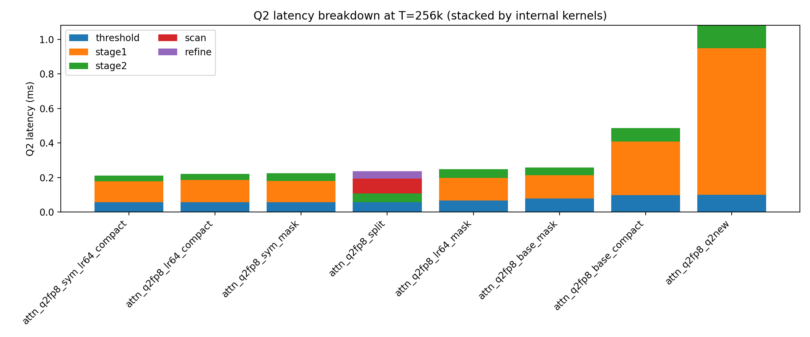

# 256k Kernel Benchmark Summary
Generated: 2026-01-10T21:15:33

## Run Info
- GPU: NVIDIA-GeForce-RTX-4090_48GB
- Step: 1024
- Max length: 262144
- Iters: 500, Warmup: 100
- BS: 128, SBS: 128, bsz: 1, delta: 5.0

## Latency Comparison (T=256k)
| Kernel | Quant | Q2 (ms) | Q2_CG (ms) | Flash (ms) | Speedup | Speedup_CG |
|---|---|---:|---:|---:|---:|---:|
| attn_q2fp8_sym_lr64_compact | sym | 0.210348 | 0.192393 | 1.126918 | 5.36x | 5.86x |
| attn_q2fp8_lr64_compact | asym | 0.220559 | 0.215329 | 1.118937 | 5.07x | 5.20x |
| attn_q2fp8_sym_mask | sym | 0.225219 | 0.221618 | 1.119982 | 4.97x | 5.05x |
| attn_q2fp8_split | asym | 0.236405 | 0.188215 | 1.117063 | 4.73x | 5.94x |
| attn_q2fp8_lr64_mask | asym | 0.247380 | 0.248220 | 1.117389 | 4.52x | 4.50x |
| attn_q2fp8_base_mask | asym | 0.258380 | 0.253462 | 1.117288 | 4.32x | 4.41x |
| attn_q2fp8_base_compact | asym | 0.485437 | 0.483215 | 2.388007 | 4.92x | 4.94x |
| attn_q2fp8_q2new | sym | 1.082161 | 1.080369 | 1.115922 | 1.03x | 1.03x |

## Kernel Profile Comparison (T=256k)
| Kernel | Total (ms) | threshold | stage1 | stage2 | scan | refine |
|---|---:|---:|---:|---:|---:|---:|
| attn_q2fp8_sym_lr64_compact | 0.455712 | 0.121856 (26.74%) | 0.265216 (58.20%) | 0.068640 (15.06%) | - | - |
| attn_q2fp8_lr64_compact | 0.456832 | 0.118816 (26.01%) | 0.266336 (58.30%) | 0.071680 (15.69%) | - | - |
| attn_q2fp8_sym_mask | 0.460000 | 0.116960 (25.43%) | 0.251904 (54.76%) | 0.091136 (19.81%) | - | - |
| attn_q2fp8_split | 0.438912 | 0.105472 (24.03%) | - | 0.094016 (21.42%) | 0.158720 (36.16%) | 0.080704 (18.39%) |
| attn_q2fp8_lr64_mask | 0.515072 | 0.138240 (26.84%) | 0.272384 (52.88%) | 0.104448 (20.28%) | - | - |
| attn_q2fp8_base_mask | 0.546816 | 0.165888 (30.34%) | 0.284672 (52.06%) | 0.096256 (17.60%) | - | - |
| attn_q2fp8_base_compact | 0.419616 | 0.084992 (20.25%) | 0.267040 (63.64%) | 0.067584 (16.11%) | - | - |
| attn_q2fp8_q2new | 1.310784 | 0.120960 (9.23%) | 1.028032 (78.43%) | 0.161792 (12.34%) | - | - |

## Raw Files
- attn_q2fp8_sym_lr64_compact: plot/attn_q2fp8_sym_lr64_compact_cudagraph/NVIDIA-GeForce-RTX-4090_48GB/delta5.0_layers1_BS128_SBS128_bsz1_262144/raw/layer_layers_1_Tmax256k_Hq24_Hkv8_D128_Dv128_BS128_SBS128_delta5_fp16_kernelattn_q2fp8_sym_lr64_compact_step1024_it500_wu100_bsz1_cudagraph_replay.json
- attn_q2fp8_lr64_compact: plot/attn_q2fp8_lr64_compact_cudagraph/NVIDIA-GeForce-RTX-4090_48GB/delta5.0_layers1_BS128_SBS128_bsz1_262144/raw/layer_layers_1_Tmax256k_Hq24_Hkv8_D128_Dv128_BS128_SBS128_delta5_fp16_kernelattn_q2fp8_lr64_compact_step1024_it500_wu100_bsz1_cudagraph_replay.json
- attn_q2fp8_sym_mask: plot/attn_q2fp8_sym_mask_cudagraph/NVIDIA-GeForce-RTX-4090_48GB/delta5.0_layers1_BS128_SBS128_bsz1_262144/raw/layer_layers_1_Tmax256k_Hq24_Hkv8_D128_Dv128_BS128_SBS128_delta5_fp16_kernelattn_q2fp8_sym_mask_step1024_it500_wu100_bsz1_cudagraph_replay.json
- attn_q2fp8_split: plot/attn_q2fp8_split_cudagraph/NVIDIA-GeForce-RTX-4090_48GB/delta5.0_layers1_BS128_SBS128_bsz1_262144/raw/layer_layers_1_Tmax256k_Hq24_Hkv8_D128_Dv128_BS128_SBS128_delta5_fp16_kernelattn_q2fp8_split_step1024_it500_wu100_bsz1_cudagraph_replay.json
- attn_q2fp8_lr64_mask: plot/attn_q2fp8_lr64_mask_cudagraph/NVIDIA-GeForce-RTX-4090_48GB/delta5.0_layers1_BS128_SBS128_bsz1_262144/raw/layer_layers_1_Tmax256k_Hq24_Hkv8_D128_Dv128_BS128_SBS128_delta5_fp16_kernelattn_q2fp8_lr64_mask_step1024_it500_wu100_bsz1_cudagraph_replay.json
- attn_q2fp8_base_mask: plot/attn_q2fp8_base_mask_cudagraph/NVIDIA-GeForce-RTX-4090_48GB/delta5.0_layers1_BS128_SBS128_bsz1_262144/raw/layer_layers_1_Tmax256k_Hq24_Hkv8_D128_Dv128_BS128_SBS128_delta5_fp16_kernelattn_q2fp8_base_mask_step1024_it500_wu100_bsz1_cudagraph_replay.json
- attn_q2fp8_base_compact: plot/attn_q2fp8_base_compact_cudagraph/NVIDIA-GeForce-RTX-4090_48GB/delta5.0_layers1_BS128_SBS128_bsz1_262144/raw/layer_layers_1_Tmax256k_Hq24_Hkv8_D128_Dv128_BS128_SBS128_delta5_fp16_kernelattn_q2fp8_base_compact_step1024_it500_wu100_bsz1_cudagraph_replay.json
- attn_q2fp8_q2new: plot/attn_q2fp8_q2new_cudagraph/NVIDIA-GeForce-RTX-4090_48GB/delta5.0_layers1_BS128_SBS128_bsz1_262144/raw/layer_layers_1_Tmax256k_Hq24_Hkv8_D128_Dv128_BS128_SBS128_delta5_fp16_kernelattn_q2fp8_q2new_step1024_it500_wu100_bsz1_cudagraph_replay.json

## Visualizations
Stacked bars are sorted by Q2 latency (shortest to longest). Segment sizes use internal kernel percentages scaled to Q2 total.

